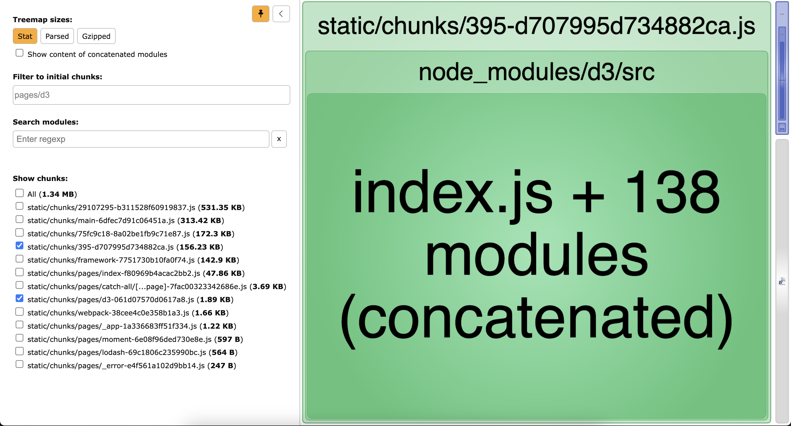
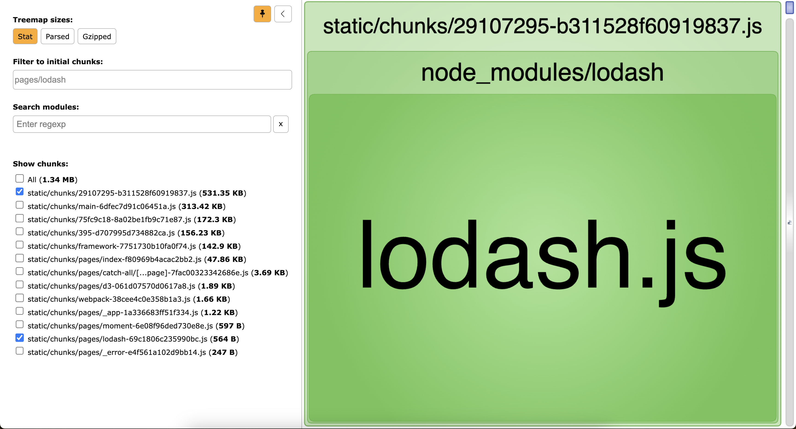
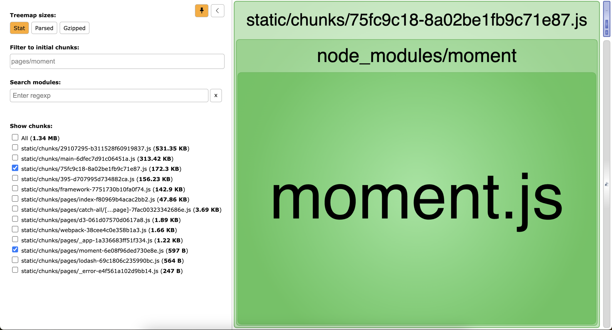
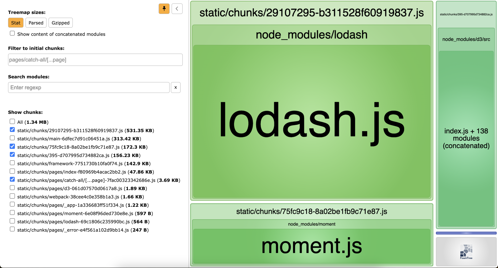

# Bundle size analysis on catch-all segment routes

## TL;DR

> [!IMPORTANT]  
> Client-size routing using catch-all segment routes will negatively affect your bundle size

- Doing client-side routing on a catch-all segment route will increase the bundle size of that route as it will include all the components and their deps. **Next.js can't optimize the bundle because the routing happens at runtime, not at build time**.
- Having individual routes results in smaller bundle sizes because Next.js can analyze them at build time.


## Detailed pages bundle sizes
### `/d3`


### `/lodash`


### `/moment`


### `/catch-all/[...page]`


## How to run this locally?

```shell
npm install
npm run analyze
```